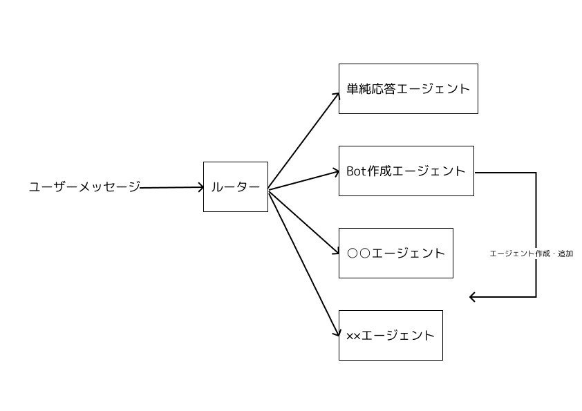

# bot作成が自由にできるマルチエージェント汎用SlackBot

## 目的
Slackなどのチャットツールを利用するとき、Bot作成は業務の効率化にとって重要な手段である。<br>
しかしながら、Bot作成には専門知識を必要とし、非エンジニアが作成するのは難しいところがある。<br>
さらに、現在目覚ましい発展を遂げている生成AIを利用するとなれば、それだけ大きな成果は期待できるが、実装も難しくなる。<br>
そこで、本プロジェクトではbotの作成を簡易化する汎用的なSlackBotを作成してみる。<br>

## 構想
非エンジニアであっても、必要なBotを簡易的につくることが目的である。<br>
そのためにチャット上の入力、すなわち自然言語での入力によって、自動的にBot作成を実行してくれる汎用Botの作成を目指す。<br>
まず、デフォルトととして「単純応答エージェント」と「Bot作成エージェント」を用意しておく。<br>
エージェントの説明は以下の通り。いずれも生成AIを用いて駆動する。<br>
- 「単純応答エージェント」はユーザーのメッセージに対して簡単な返事をする。
- 「Bot作成エージェント」はユーザーのメッセージの応じて、新たにエージェントを作成する。<br>

ユーザーからメッセージを受け付けると、「ルーター」がメッセージを分析し、実行するエージェントを選択する。<br>
もし「Bot作成エージェント」が選択された場合、新たにエージェントが作成され、追加される。<br>

<br>
(イメージ図)



## 各種エージェントプロンプト
### エージェントのデータ構造
jsonで保存される
```
[
    {
      "id": "event_0",
      "name": "単純応答",
      "description": "このイベントは、ユーザーのメッセージに対して単純な応答を返すものです。他のイベントが適用できない場合に使用されます。",
      "instruction": "ユーザーメッセージに対して、応答してください。",
      "example_message": [
        "こんにちは", 
        "おはよう", 
        "こんばんは",
        "元気？",
        "調子はどう？",
        "最近どう？",
        "お疲れ様です",
        "おやすみなさい",
        ]
    },
    {
      "id": "event_1",
      "name": "新規タスク作成。",
      "description": "ユーザーがこれから、ボットに新しくタスクの実行を求めた時に、実行するイベントです。何かを条件に、何かを実行して欲しい場合に、実行するイベントです。",
      "example_message": [
        "議事録を送ったら、要約して", 
        "これから、メールを添削してと言ったら、添削して",
        "メッセージがネガティブだったら、ポジティブに変換して",
        ]
    },
]
```

- id: 識別するための固有のid
- name: 実行内容を一言で表した名前
- description: エージェントが実行するタスクについての詳細な説明。「ルーター」はここの説明を参照して、実行するエージェントを選択する
- example_message : このエージェントを選択する場合のユーザーのメッセージの例


### ルーター
```
## タスク
あなたの役割は、ユーザーが送信したメッセージの内容に基づいて、事前に定義されたタスクリストから最も適切なイベントを選択することです。

## タスクデータ
タスクは以下のJSON形式で提供されています：
\```json
{events_str}
\```

## 選択プロセス
1. ユーザーのメッセージを解析し、目的、関心などの主要な情報を抽出してください
2. 抽出した情報をイベントリストの各イベントと照合します
3. 最も関連性の高いイベントを選択します
4. 選択したイベントのIDのみを返します

## 出力形式
選択したイベントのIDのみを次の形式で返してください：
\```
event_1
\```

## ユーザーメッセージ
{message_str}
```

ルーターは上記のエージェントのデータを{events_str}として受け取り、適切なエージェントを受け取る

### エージェント実行プロンプト
```
あなたはチャットボットアシスタントとして以下のユーザーメッセージについて指示に従ったタスクを実行して

ただし、普通のマークダウンを使うことは禁止されてます。以下ルールに従って、出力を装飾して。
<rule>
# Slackでのマークダウンのルール

## 基本的な書式設定

**太字**
- 書き方: `*太字*` または `**太字**`

*斜体*
- 書き方: `_斜体_` または `*斜体*`

~~取り消し線~~
- 書き方: `~取り消し線~`

`コード`
- 書き方: `` `コード` ``

\```
コードブロック
\```
- 書き方: ````コードブロック````

> 引用
- 書き方: `> 引用文`

## リスト

箇条書きリスト:
- 書き方: `• 項目1` または `- 項目1`

番号付きリスト:
1. 書き方: `1. 項目1`

## リンク

[リンクテキスト](https://example.com)
- 書き方: `<https://example.com>` または `[リンクテキスト](https://example.com)`

## その他の機能

### メンション
- ユーザーメンション: `@ユーザー名`
- チャンネルメンション: `#チャンネル名`
- 全員へのメンション: `@here` または `@channel`

### 絵文字
- 通常の絵文字: `:smile:` → 😄
- カスタム絵文字: `:カスタム絵文字名:`

### 区切り線
- 書き方: `---` または `***` または `___`
</rule>

## 指示
{task_instruction}

## ユーザーメッセージ
{user_message}
```

上記のエージェントデータのinstructionが実行用のプロンプトとして組み込まれ、タスクが実行される。<br>
Slack用のマークダウンに対応させるため、一連の設定を記述している

## タスク作成プロンプト

```
AIにタスクを実行させるためのjsonデータを作成しようと思っています。ユーザーメッセージに従って、指定したjsonデータを作成してください。

# json形式
{{
 "name" : str,
 "description": str,
 "example_message":str[],
"instruction": str
}}

## 説明
- name : タスクの簡単な名前
- description: タスクの内容についての説明。タスクの発動条件を詳しく、様々可能性を想定して定義する。特に他のタスクと発動条件を区別きるようにする。
- example_message: このタスクを発動する具体的なユーザーからのメッセージの例
- instruction: AIに渡す、タスクを実行するためのプロンプト。プロンプトにはユーザーメッセージが自動的に渡される予定です。具体的なユーザーメッセージメッセージについてはここで記述しないこと。

## 例
\```
{{
    "name": "アイデアだし",
    "description": "ユーザーが「○○のアイデア出して」と言ったら、アイデアを10個出すイベントです。",
    "example_message" : ["企業のアイデアを出して"、"業務効率化のアイデアをだして"],
    "instruction":"ユーザーメッセージに求められているアイデアを10個だして"
    }}
\```
\```
{{
    "name": "ポジティブ変換",
    "description": "ユーザーがネガティブなメッセージを書いていたとき、それをポジティブに変換する",
    "example_message" : ["失敗してつらい"、"将来が不安"],
    "instruction":"ユーザーメッセージをポジティブなものに変換して"
    }}
\```

# ユーザーメッセージ
{user_message}


Assistant:json形成で一つだけ出力します。

```

<br>


## プロジェクト構造
- gemini: geminiを利用をまとめた関数群。テキスト形式のJSONの変換関数もある
- logic: 全体のシステムの流れを記述している。各フェーズでの細かい実装はmodulesに記述
- main: Slackとの連携及びBotの起動処理を記述
- modules: 各フェーズでの細かい実装を記述。プロンプト等もここに記述

<br>
<br>
<br>

## セットアップ
### 前提条件
- Docker およびがインストールされ、Slackの各種設定ができていること

### .envを設定
/app直下に.envファイルを作成
```
SLACK_BOT_TOKEN = xoxb-******
SLACK_APP_TOKEN = xapp-*****

GEMINI_KEY = ****
```

### 1.リポジトリをクローン
```
git clone https://github.com/yoshiInGit/slcak_gen_bot
cd slack_gen_bot
```

### 2.Docker イメージのビルド
```
docker build -t my-python-app .
```

### 3.コンテナの起動
```
docker run -it --entrypoint /bin/bash my-python-app
```

